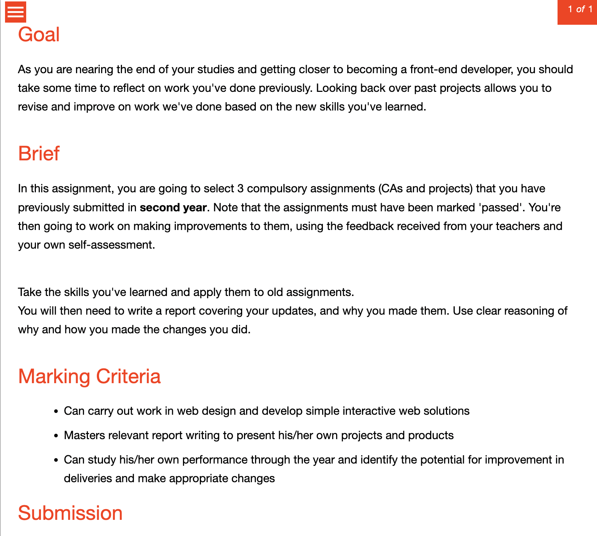

#### Studenter FYI
Får dere dårlig tid til å lage / oppdatere portfolio siden så er ikke det pri #1
Fokuser på å oppdatere gamle prosjekter (trenger ikke være drastiske endringer).
Snakk med meg om du er usikker.

Prio:
3 prosjekter
Presentasjon.

Resten er andreprio.

Vil du oppdatere portfolio siden din og bruke det som en av de 3 så er det også lov.

--- 

Ca. lenge på presentasjon: 10-15 minutter

---

#### Studenter
Samt får vi besøk fra industrien på fredag.

**Presentasjonene starter 10:00** og eg har booket auditorium til det.

I utgangspunktet presenterer dere til hverandre, +meg +industrien. men om dere ABSOLUTT ikkje vil presentere forran de andre i klassen så send meg en melding.

Nærmere detaljer kommer.

---

### Les hele meldingen og reager på den når du har lest ferdig.

Nå gir alt litt mer mening. Dere har sett en helt annen Brief for Portfolio en det eg har.
Det virker som at det berre er min bruker som ikkje ser den "riktige" briefen, da de andre lærerene ser den dere ser.
Eg visste ikkje at dokke såg en annen brief og det har da blitt litt uheldig miks.

##### VIKTIG INFO:
BEGGE briefer blir akseptert som BASIS for leveranse i moodle.
PRESENTASJONEN må dere fortsatt lage og levere.

##### OM PRESENTASJONEN
Presenter de ulike prosjektene dine samt portfolio siden din dersom det er relevant,
Snakk gjerne om teknologivalg, endringer i planer osv osv.
Dette er også en gylden mulighet til å prate om Prosjekt Eksamen 2.
Som sagt tidligere vil det dere evt sier om Prosjekt Eksamen 2 bare hjelpe med karakter - ikke trekke ned.

Når presentasjonen er holdt laster dere ned Presentasjonen som PDF og leverer den i moodle på portfolio 2.

Dette er en feil som ligger på vår side og dere får ingen konsekvenser fra det selvsagt.

BILDE AV BRIEF 2:
