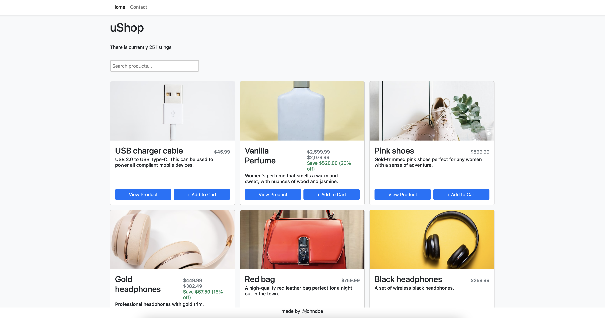
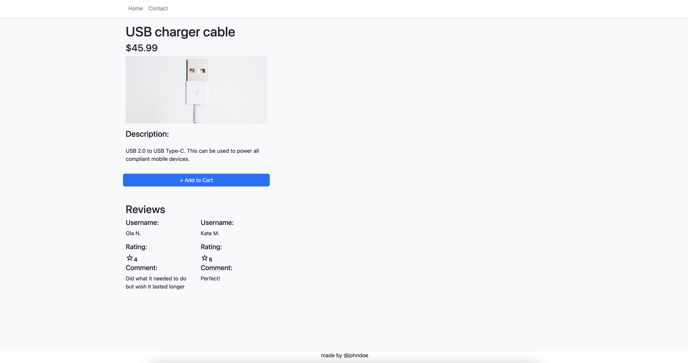
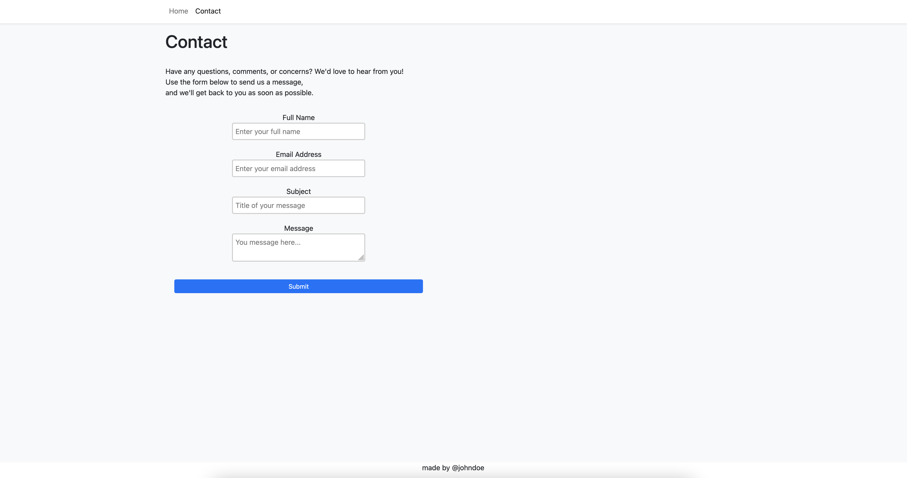

# JavaScript Frameworks CA

**Student:** [Silje Angelvik](https://github.com/siljeangelvik)    
**Host:** [Netlify](https://react-ts-ecom-cart.netlify.app/)   
**Repository:** [GitHub](https://github.com/siljeangelvik/react-ts-shopping-cart)

| Resources | URLs                                                                                                                                                                                                                                                                                                                                                                                                                                            |
|:----------|:------------------------------------------------------------------------------------------------------------------------------------------------------------------------------------------------------------------------------------------------------------------------------------------------------------------------------------------------------------------------------------------------------------------------------------------------|
| Noroff    | [Project Brief](https://lms.noroff.no/mod/assign/view.php?id=83441) - [API Endpoints](https://api.noroff.dev/api/v1/online-shop)                                                                                                                                                                                                                                                                                                                |                                                                                                                                                                                                                     |

## uShop Online Shop

 <br/>
 

## Description

This is a simple e-commerce application that fetches data from an API and displays it on the page.

The user can add and remove items from the cart, and the cart is saved in local storage. The user can also view the
details of each item.

## Built With

- [HTML](https://developer.mozilla.org/en-US/docs/Web/HTML)
- [CSS](https://developer.mozilla.org/en-US/docs/Web/CSS)
- [JavaScript](https://developer.mozilla.org/en-US/docs/Web/JavaScript)
- [TypeScript](https://www.typescriptlang.org/)
- [tsx](https://www.typescriptlang.org/docs/handbook/jsx.html)
- [React.js](https://reactjs.org/)
- [React Router DOM](https://reactrouter.com/web/guides/quick-start)
- [React-Bootstrap](https://react-bootstrap.github.io/)
- [Bootstrap](https://getbootstrap.com)
- [Redux Toolkit](https://redux-toolkit.js.org/)
- [RTK Query](https://redux-toolkit.js.org/rtk-query/overview)
- [Yup](https://www.npmjs.com/package/yup)
- [Git](https://training.github.com/downloads/github-git-cheat-sheet/)
- [GitHub](https://github.com/about)
- [Formik](https://formik.org/)
- [Vite](https://vitejs.dev/)
- [Netlify](https://www.netlify.com/)
- [PhpStorm](https://www.jetbrains.com/phpstorm/)
- [Noroff API _Online Shop_ Endpoints](https://api.noroff.dev/api/v1/online-shop)

## Getting Started

### Installing

1. Clone the repo:

```bash
git clone git@github.com:siljeangelvik/react-ts-shopping-cart.git
```

2. Install the dependencies:

```
npm install
```

### Running

To run the app in development mode:

```bash
npm run dev
```

To build the app:

```bash
npm run build
```

To preview the app:

```bash
npm run preview
```

## Contributing

No contributions at this time.

## Contact

Click on the badges below to go to my profiles or contact me via email.

<a href = "https://www.linkedin.com/in/siljeangelvik/">
    
</a>
<a href = "https://github.com/siljeangelvik">
    
</a>
<a href = "mailto: angelviksilje@gmail.com">
    
</a>

## Acknowledgments

### Resources

Not all resources have been used, but I have included them here for future reference.

> #### Docs
> - [Tanstack](https://tanstack.com/query/v4/docs/react/quick-start)
> - [Redux Toolkit Setup Tutorial](https://dev.to/raaynaldo/redux-toolkit-setup-tutorial-5fjf)
> - [RTK Query Quick Start](https://redux-toolkit.js.org/tutorials/rtk-query)
> - [Redux Configuring Your Store](https://redux.js.org/usage/configuring-your-store)
> - [Clear Redux Toolkit State using Redux-Persist](https://bionicjulia.com/blog/clear-redux-toolkit-state-with-redux-persist-and-typescript)
> - [Use Redux Persist in React Native](https://blog.logrocket.com/use-redux-persist-react-native/)
> - [useSelector and useDispatch React-Redux Hooks](https://builtin.com/software-engineering-perspectives/useselector-usedispatch-react-redux)
> #### Videos and Tools
> - [Custom React Hooks](https://www.youtube.com/watch?v=0c6znExIqRw&list=PLZlA0Gpn_vH-aEDXnaFNLsqiJWFpIWV03)
> - [Custom React Hooks 2](https://www.youtube.com/watch?v=vrIxu-kfAUo)
> - [React Query](https://www.youtube.com/watch?v=lVLz_ASqAio)
> - [useEffect in 13 minutes](https://www.youtube.com/watch?v=0ZJgIjIuY7U)
> - [Shopping Cart with React and TypeScript](https://www.youtube.com/watch?v=lATafp15HWA)
> - [Redux Toolkit Cart Demo](https://codesandbox.io/embed/redux-toolkit-cart-demo-forked-fkb5d?codemirror=1)