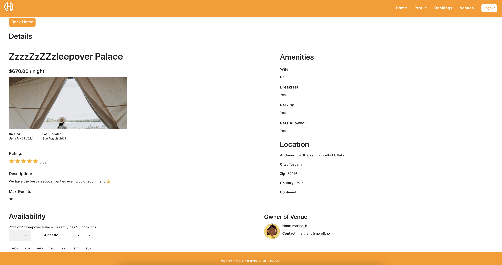
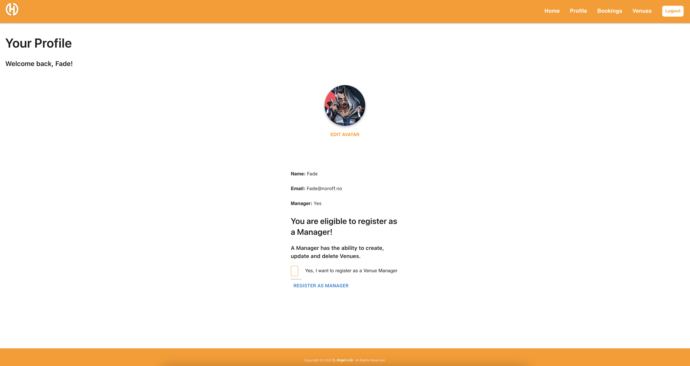

# Project Exam 2

[](https://app.netlify.com/sites/exam-holidaze/deploys)  

  


## Holidaze 

[CA Delivery](https://lms.noroff.no/mod/assign/view.php?id=83438)  
[GitHub Repo](https://github.com/siljeangelvik/react-antd-holidaze-exam)  
[Netlify](https://exam-holidaze.netlify.app/)

  
  


## Description

This is a React exam project for the course "Frontend Development 2" at Noroff.   
The project is a website for a fictional venue booking application called "Holidaze".   
The website is built with React, AntDesign, Sanity.io and Netlify.   
This project contains a single page application with a home(list of venues) page,   
a profile page and a detail page for each venue.

What are the technical solutions?
: N/A ...

What are the technologies used?
: N/A ...

What would you do differently next time?
: N/A ...

What are the things you were happy with?
: N/A ...

## Built With

- [HTML](https://developer.mozilla.org/en-US/docs/Web/HTML)
- [CSS](https://developer.mozilla.org/en-US/docs/Web/CSS)
- [JavaScript](https://developer.mozilla.org/en-US/docs/Web/JavaScript)
- [React.js](https://reactjs.org/)
- [Create React App](https://create-react-app.dev/)
- [Ant Design](https://ant.design/)
- [Material UI](https://material-ui.com/)
- [React Router DOM](https://reactrouter.com/web/guides/quick-start)
- [Yup](https://www.npmjs.com/package/yup)
- [Git](https://training.github.com/downloads/github-git-cheat-sheet/)
- [GitHub](https://github.com/about)
- [Yarn](https://yarnpkg.com/)
- [Netlify](https://www.netlify.com/)
- [PhpStorm](https://www.jetbrains.com/phpstorm/)
- [Noroff API _Holidaze_ Endpoints](https://api.noroff.dev/api/v1/holidaze/venues)
- [Noroff API Docs](https://docs.noroff.dev/holidaze/venues) 

## Getting Started

### Installing

1. Clone the repo:

```bash
git clone git@github.com:siljeangelvik/react-antd-holidaze-exam.git
```

2. Install the dependencies:

```
yarn install
```

### Running

To run and preview the app:

```bash
yarn start
```

## Contributing

No contributions at this time.

## Contact

Click on the badges below to go to my profiles or contact me via email.

<a href = "https://www.linkedin.com/in/siljeangelvik/">
    
</a>
<a href = "https://github.com/siljeangelvik">
    
</a>
<a href = "mailto: angelviksilje@gmail.com">
    
</a>

## Acknowledgments

### Resources

[Sanity Yup Form](https://www.sanity.io/guides/form-validation-with-npm-yup)  
[React Router v6](https://www.youtube.com/watch?v=Ul3y1LXxzdU)  
[Google Fonts Combination 2023](https://puzzlepiecesmarketing.com/blog/8-best-google-font-combinations-2022/)    
[Colour Trends 2023](https://www.google.com/url?sa=t&rct=j&q=&esrc=s&source=web&cd=&cad=rja&uact=8&ved=2ahUKEwjA597Vjtv-AhUpRfEDHZQ4CIYQFnoECBUQAw&url=https%3A%2F%2Fwww.gira.com%2Fen%2Fen%2Fg-pulse-magazine%2Finterior-ideas%2Fnew-year-new-colours&usg=AOvVaw2Z8mwQ0kgnWdgpLTQpSMdL)    
[Colors Toolbox](https://uxpro.cc/toolbox/visual-design/colors/)    
[Culrs](https://culrs.com/#/tetradic)    
[GitHub Profile Badges](https://home.aveek.io/GitHub-Profile-Badges/)  
[React Hook](https://docs.noroff.dev/holidaze/venues)  
[Current User](https://www.back4app.com/docs/react/working-with-users/get-current-user-react)  
[Fastify](https://github.com/fastify/fastify-jwt)  
[Unicode Checkmark](https://www.compart.com/en/unicode/U+2713)  
[Logo Idea](https://www.youtube.com/watch?v=NCaP15N3g4s)  
[React Admin](https://marmelab.com/react-admin/Edit.html)  
[React Form](https://www.youtube.com/watch?v=JX36ga1O6xo)  
[Sandbox Delete from List](https://codesandbox.io/embed/n43z9w3o0?codemirror=1)  
[Sandbox Add ToDo](https://codesandbox.io/embed/build-a-todo-app-with-react-cc4l8?codemirror=1)  
[AntDesign Modal](https://3x.ant.design/components/modal/)  
[AntDesign AutoComplete](https://3x.ant.design/components/auto-complete/)  
[AntDesign Card](https://3x.ant.design/components/card/)  
[AntDesign Table](https://3x.ant.design/components/table/)  
[React UseEffect](https://legacy.reactjs.org/docs/hooks-effect.html)  
[React Form Validation with Formik and Yup](https://www.smashingmagazine.com/2020/10/react-validation-formik-yup/)    
[React Form Validation with React Hook Form and Yup](https://dev.to/franciscomendes10866/react-form-validation-with-react-hook-form-and-yup-4a98)  
[React Search Filter](https://contactmentor.com/build-reactjs-search-filter/)  
[React Calendar with Events](https://contactmentor.com/create-reactjs-calendar-events/)  
[Netlify Redirect Options](https://docs.netlify.com/routing/redirects/redirect-options/#custom-404-page-handling)  
[Netlify Redirects for 404 Forum](https://answers.netlify.com/t/redirects-for-404s-with-role-based-access-control/31353)  
[Netlify Custom 404-Page Forum](https://answers.netlify.com/t/i-have-a-custom-404-page-in-react-app-but-its-not-rendering-insteand-its-showing-netlify-404-page/88848)   
[Netlify Redirects Forum](https://answers.netlify.com/t/support-guide-i-ve-deployed-my-site-but-i-still-see-page-not-found/125?utm_source=404page&utm_campaign=community_tracking)  
[Guide to Authentication with React Router v6](https://blog.logrocket.com/complete-guide-authentication-with-react-router-v6/)  
[React Clean Code](https://dev.to/thawkin3/react-clean-code-simple-ways-to-write-better-and-cleaner-code-2loa)  
[Clean Up Your React Code](https://javascript.plainenglish.io/clean-up-your-react-code-63992a82d8e7)  
[Tips to Write Clean React Code](https://javascript.plainenglish.io/6-important-tips-to-write-clean-react-code-5ef29d6a73a6)  
[Use React Context for Auth](https://dev.to/dayvster/use-react-context-for-auth-288g)  
[React Router v6 in 45 minutes](https://www.youtube.com/watch?v=Ul3y1LXxzdU)  
[Dev Server](https://webpack.js.org/configuration/dev-server/)  
[RTK-Example GitHub](https://github.com/jonfossheim/RTK-Example/tree/main/src/pages)  
[Starter React GitHub](https://github.com/jonfossheim/starter-react/blob/main/package.json)  
[5 Custom React Hooks](https://www.youtube.com/watch?v=0c6znExIqRw)  
[Infinite Scroll AntDTS Mobile](https://www.typescriptlang.org/play?skipLibCheck=true&jsx=1&ssl=24&ssc=2&pln=1&pc=1&filetype=js#code/JYWwDg9gTgLgBAJQKYEMDGMA0cDecCuAzkgMowoxJwC+cAZlBCHAORSoYsBQoksucAJIA7OsGHBKJNIwA2s7ABlgheLQZNWKYTAAmAWhAQARsFlJuvaPDxG0Aa2QBHfElU16jZiwB0Aejt7fXYXNxhuLiQADz54XSQ6FHxZeAAKAEo4AF4APlwuODg0CGF3AG1dChRsYhgAESqAXWyCYjIKJAAeVShxAHMyxpzUwfSCopLygAsUQgBZaCQapBgACVmF9mas1tJySlSYKFcxwtmAT2E0enwrmGASuFkIFF1NpAz8wsLi0vgUMBgJDCXQtFAAdxQkjggWcrlUGXGhVqDXIqQAbihZNk8mUfPjMQo4PifACgSDGqdvrV1vNFqkycDdD5zMI+jApnA8gAGKnULjjdgwfBQYRwVJIuCdHKSwqdZSqGXfZW4SrkHwgAGpVKSJAgbDieJRTK5cWylXylQwHyCSjMexIc5ZHCG6LUHIuu3UTp+BXW216pUqwrpdL84M+v1B5WdERiCRSGQQeRPF5vRbO56vd60GZ09jOvM5uB+aNS0vjMbUIA)    
[GitHub README Badges](https://github.com/anuraghazra/github-readme-stats)  
[Top 5 Badges for you Repository](https://www.makeuseof.com/badges-that-will-supercharge-your-github-repository/)    
[Random Joke Generator](https://github.com/ABSphreak/readme-jokes)  
[GitHub Badges Theme](https://github.com/anuraghazra/github-readme-stats/blob/master/themes/README.md)  
[Shields.io](https://shields.io/)   
[CRA Deployment](https://create-react-app.dev/docs/deployment/)  
[Push Into Array JS](https://www.freecodecamp.org/news/how-to-insert-an-element-into-an-array-in-javascript/)