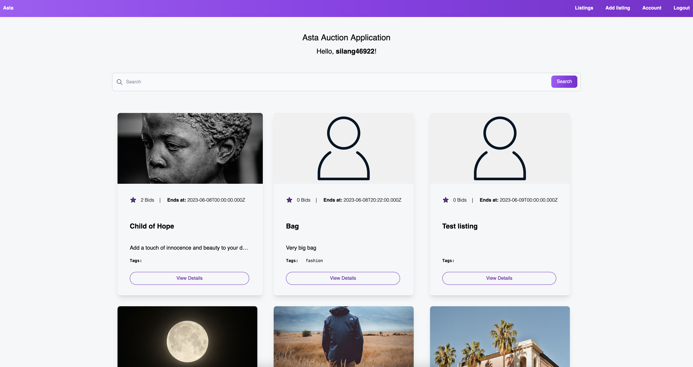
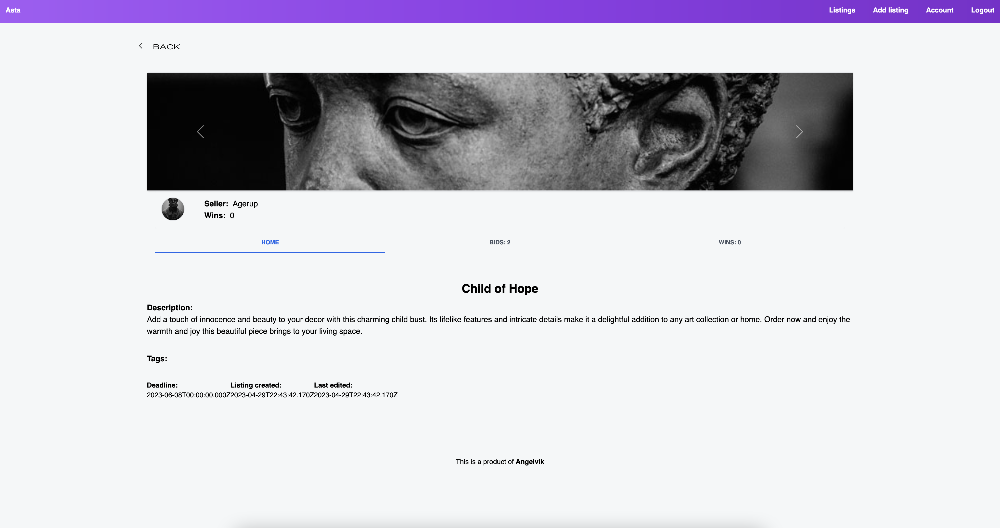
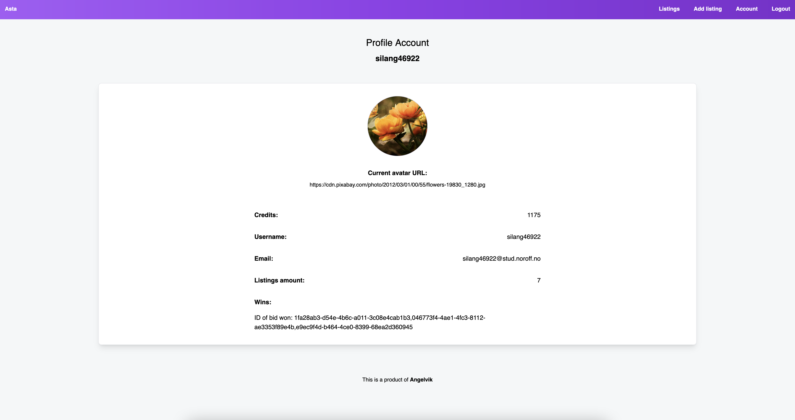

# Semester Project 2

## Asta Auction

[CA Delivery](https://lms.noroff.no/mod/assign/view.php?id=83437)  
[GitHub Repo](https://github.com/siljeangelvik/semesterproject2)  
[Netlify](https://silje-semesterproject2.netlify.app/)





## Description

This is a web application for an auction house called Asta Auction. The application is built with JavaScript and
TailwindCSS. The application is responsive and works well on mobile, tablet, and somewhat desktop. The application is
built with a mobile-first approach.

What are the technical solutions?
: The technical solutions are to use JavaScript to fetch users listings and items from the API and display them on the
page.

What are the technologies used?
: JavaScript, TailwindCSS, HTML, CSS, Git, GitHub, Netlify, and PhpStorm IDEA.

What would you do differently next time?
: I would like to add a functional searchbar to the application, as well as fixing small details like formatting the
dates, fixing the size of the image on details page, make a proper back-button, and adding a filter function.

What are the things you were happy with?
: I am happy with the overall design of the application, and that I managed to make it responsive.
: I am also happy with the functionality of the application, and that I managed to make it work with the API.
: Making an image carousel was something I tested out the first year, and quickly found it to be a challenge. I am
happy with the carousel I made on the details page of this
project. ([example](https://silje-semesterproject2.netlify.app/details/index.html?id=cc5bfbc5-1944-49f4-b29c-7bccc671e076)).

## Built with

- [HTML](https://developer.mozilla.org/en-US/docs/Web/HTML)
- [CSS](https://developer.mozilla.org/en-US/docs/Web/CSS)
- [SASS](https://sass-lang.com/)
- [JavaScript](https://developer.mozilla.org/en-US/docs/Web/JavaScript)
- [TailwindCSS](https://tailwindcss.com/)
- [Git](https://training.github.com/downloads/github-git-cheat-sheet/)
- [GitHub](https://github.com/about)
- [Vite](https://vitejs.dev/)
- [Netlify](https://www.netlify.com/)
- [PhpStorm](https://www.jetbrains.com/phpstorm/)
- [Noroff API _Auction House_ Endpoints](https://docs.noroff.dev/auctionhouse-endpoints/authentication)

## Getting started

### Installing

1. Clone the repo:

```bash
git clone git@github.com:siljeangelvik/semesterproject2.git
```

2. Install the dependencies:

```
npm install
```

### Running

To run the app in development mode:

```bash
npm run dev
```

To build the app:

```bash
npm run build
```

To preview the app:

```bash
npm run preview
```

## Contributing

No contributions at this time.

## Contact

Click on the badges below to go to my profiles or contact me via email.

<a href = "https://www.linkedin.com/in/siljeangelvik/">
    
</a>
<a href = "https://github.com/siljeangelvik">
    
</a>
<a href = "mailto: angelviksilje@gmail.com">
    
</a>

## License

A repository where anyone can use to create a static webpage containing the most up-to-date ISC license.

[ISC License](https://opensource.org/licenses/ISC) from Open Source
Initiative [ISC License](https://www.isc.org/downloads/software-support-policy/isc-license/) from the Internet Systems
Consortium [ISC License](http://cvsweb.openbsd.org/cgi-bin/cvsweb/src/share/misc/license.template?rev=HEAD) from OpenBSD

The ISC copyright is functionally equivalent to a two-term BSD copyright with language removed that is made unnecessary
by the Berne convention. This is the preferred license for new code incorporated into OpenBSD.

## Acknowledgments

### Resources

> #### Docs
> - Vite: [Getting Started](https://vitejs.dev/guide/)
> - Vite: [Configure](https://vitejs.dev/config/#build-outdir)
> - Tailwind: [Getting Started](https://tailwindcss.com/docs/installation)
> - GitHub: [Docs](https://docs.github.com/en/rest/overview/permissions-required-for-fine-grained-personal-access-tokens)
> - GitHub: [Adding local project to Git Repo](https://gist.github.com/alexpchin/102854243cd066f8b88e)
> - GitHub: [Managing Remote Repositories](https://docs.github.com/en/get-started/getting-started-with-git/managing-remote-repositories#switching-remote-urls-from-https-to-ssh)
> - Dev.to: [Host Free GitHub Pages](https://dev.to/github/how-to-host-your-first-site-for-free-on-github-pages-45ob)
> - Stackoverflow: [Loop through Object Array and Access Properties](https://stackoverflow.com/questions/16626735/how-to-loop-through-an-array-containing-objects-and-access-their-properties)
> #### Videos and Tools
> - Video: [Install Tailwind with Vite](https://www.youtube.com/watch?v=c0UnSx06BCU)
> - Video: [Setup Multiple Page Vite](https://www.youtube.com/watch?v=STeKBm67l6M)
> - Emojipedia: [Emojis](https://emojipedia.org/)
> - FreeCodeCamp: [CRUD](https://www.freecodecamp.org/news/learn-crud-operations-in-javascript-by-building-todo-app/)
> - Adobe: [Color Wheel](https://color.adobe.com/create/color-wheel)
> - Codepen: [Tailwind Form](https://codepen.io/novenine/pen/xxKPrrG)
> - Codepen: [LoadMore](https://codepen.io/tutsplus/pen/XWERxrv)
> - Codepen: [Load More Content](https://codepen.io/huladesign/pen/NWqENmM)
> - Codepen: [Click to Open Search Input](https://codepen.io/matthieuSolente/pen/azVaNM?editors=0110)
> - Codepen: [Functioning Modal](https://codepen.io/f7deat/pen/JjROpPv)
> - Tailwind: [JavaScript Regular Modal](https://www.creative-tim.com/learning-lab/tailwind-starter-kit/documentation/javascript/modals/regular)
> - Google: [Material Icons](https://fonts.google.com/icons)
> - Medium: [node.js](https://medium.com/@sarthakmittal1461/to-build-login-sign-up-and-logout-restful-apis-with-node-js-using-jwt-authentication-f3d7287acca2)
